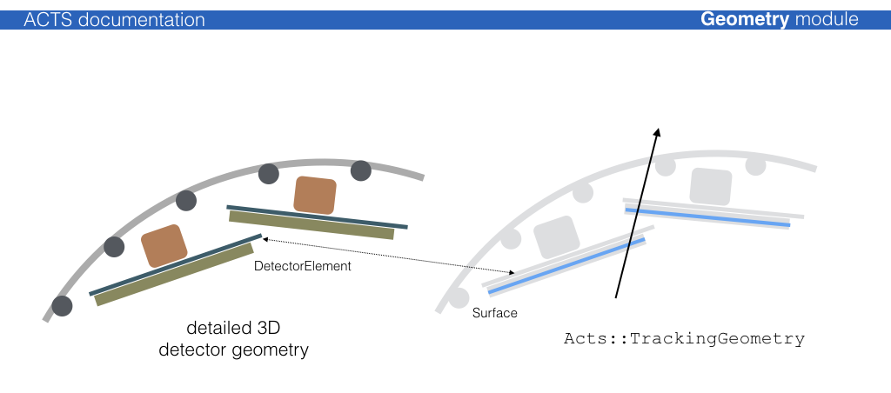
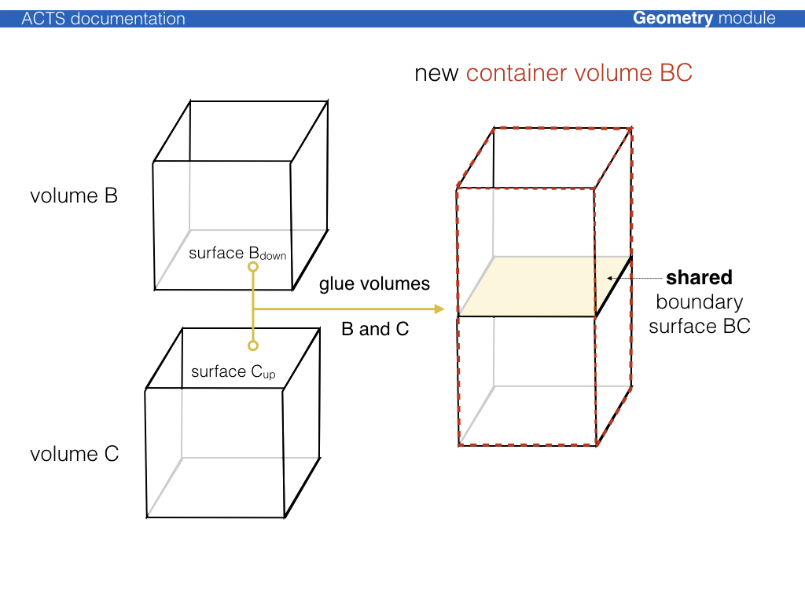
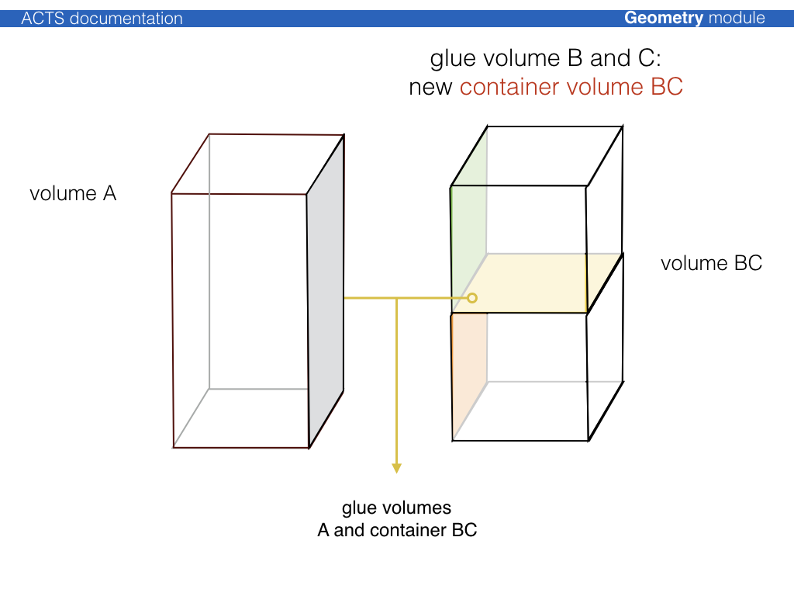
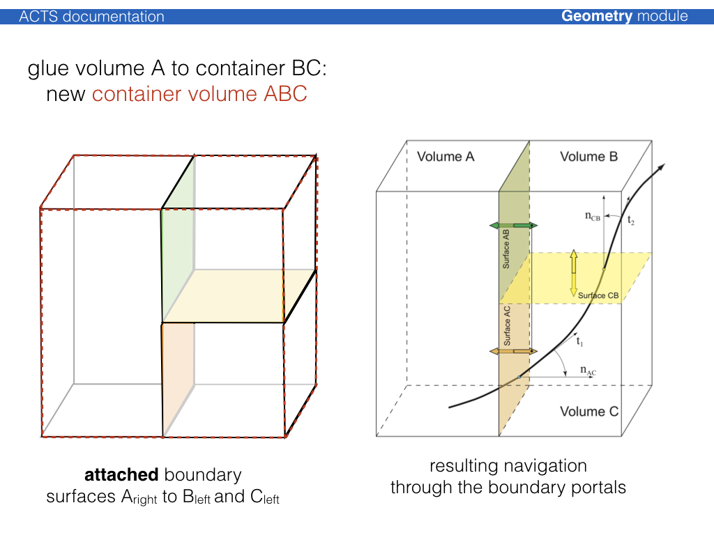

<!--
SPDX-PackageName: "ACTS"
SPDX-FileCopyrightText: 2016 CERN
SPDX-License-Identifier: MPL-2.0
-->

# Geometry building

The geometry building procedure follows the ATLAS tracking geometry philosophy of
a static frame of *glued* volumes, that lead the navigation flow through the
geometry,

## Attaching a 3D detector geometry

Usually, a 3D detector model geometry exists, which is either native to the full
detector simulation (Geant4) or is translated into it. This model, however, is
in general too detailed for track reconstruction: navigating through the
detailed detector geometry is generally costly and one can profit greatly from a simplification mechanism.

For most part of the track reconstruction, only a surface based description of
the detector is needed, in order to allow (surface based) material integration
and parametrization/prediction of trajectories on detection surfaces. It is thus
necessary that the detection surfaces are described to full detail in the
reconstruction geometry (called {class}`Acts::TrackingGeometry`). This is guaranteed by a
proxy mechanism that connects the detection elements (conveniently called
{class}`Acts::DetectorElementBase`) to {class}`Acts::Surface` object in the reconstruction:



### Existing plugins for 3D geometry libraries

Very simple helper methods for 3D libraries exist, they are certainly not
optimised, but used for templating:

* {class}`Acts::TGeoDetectorElement` connects a TGeo volume to a {class}`Acts::Surface`
* {class}`Acts::DD4hepDetectorElement` connects a DD4hep volume (based on TGeo) to a {class}`Acts::Surface`
* {class}`Acts::Geant4DetectorElement` connects a Geant4 volume to a {class}`Acts::Surface`

Further extensions exist in dedicated experiment contexts, such as e.g. a `GeoModel`
binding for the ATLAS experiment.

```{note}
While `DD4hep` offers a descriptive language with a dedicated extension mechanism
that can be used by ACTS to interpret the underlying geometry hierarchy and and structure,
there is no such guarantee when having the already as built `TGeo` geometry in hand.
Therefore a dedicated ACTS configuration file based on `json` can be provided that allows
to specify parsing restrictions for sub detectors.
```


## Layer building

{class}`Acts::Surface` objects that are to be grouped on a layer should be put into a
{class}`Acts::SurfaceArray` and provided to the layer. Certain helper tools exist to ease the
translation and create appropriate binning structure: The {class}`Acts::SurfaceArrayCreator`
can create cylindrical, disc-like & planar layers, where the dimensions of the
layer are determined by parsing the provided surfaces. Additionally, an envelope
covering the surfaces can be chosen.

```{note}
There exist standard layer builders that are designed to build cylindrical, disk like
and planar layers and perform the ordering of the surfaces onto those layers. These
builders are called from the top level translation entry points from either `TGeo`
or `DD4hep`.
```


## Volume building, packing, and gluing

The philosophy of the {class}`Acts::TrackingGeometry` is a fully connective geometry setup,
i.e. {class}`Acts::TrackingVolume` objects are either pure containers for other contained
{class}`Acts::TrackingVolume` instances (where the contained volumes fully fill the space of
the container volume), or are fully attached via the boundary surface mechanism.
The boundary surfaces then act as portals from one {class}`Acts::TrackingVolume` into the
next one along the trajectory.

The process to create a fully connected tracking geometry is called glueing.
Wherever possible, common boundary surfaces are *shared*, where this is not
possible, they are *attached*.





For cylindrical detector setups, a dedicated {class}`Acts::CylinderVolumeBuilder` is
provided, which performs a variety of volume building, packing and gluing.

```{note}
For most cylindrical detectors, there exist automated glueing and geometry building
modules that take care of the glueing process.
```
