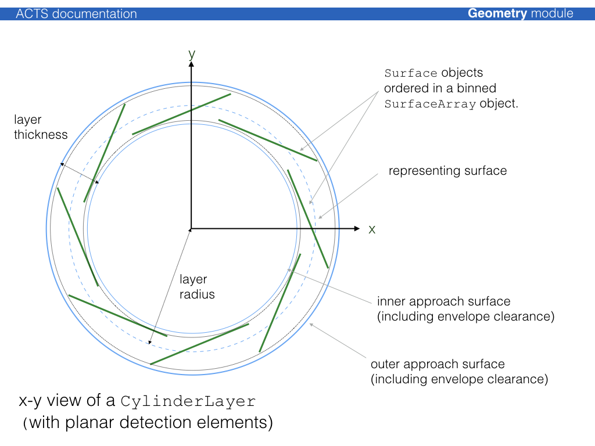
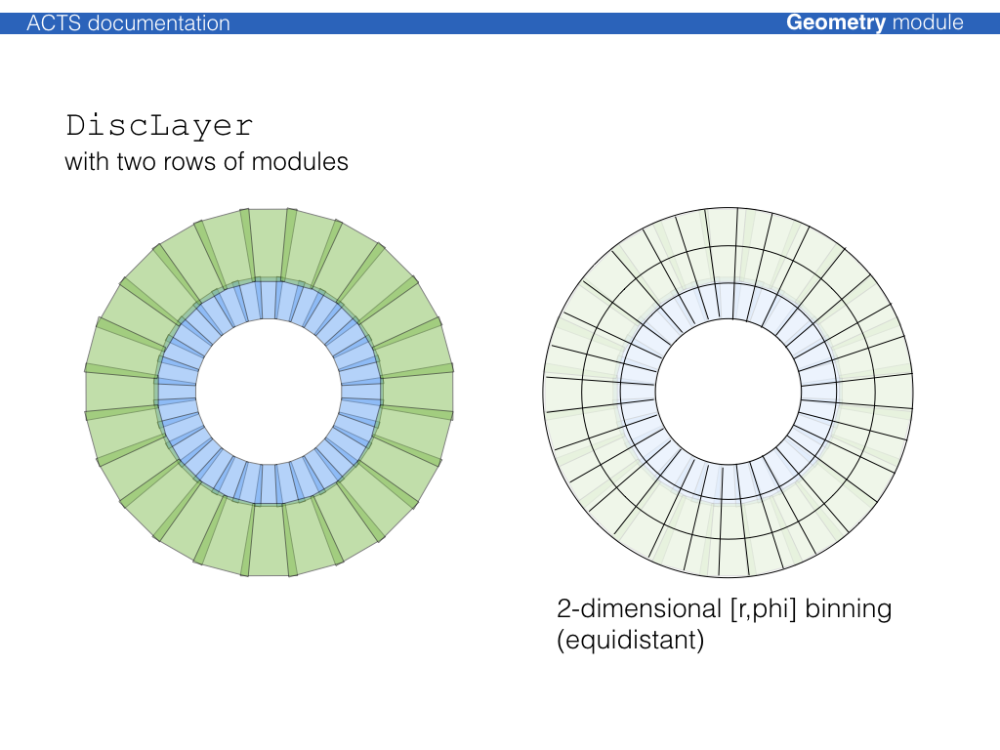
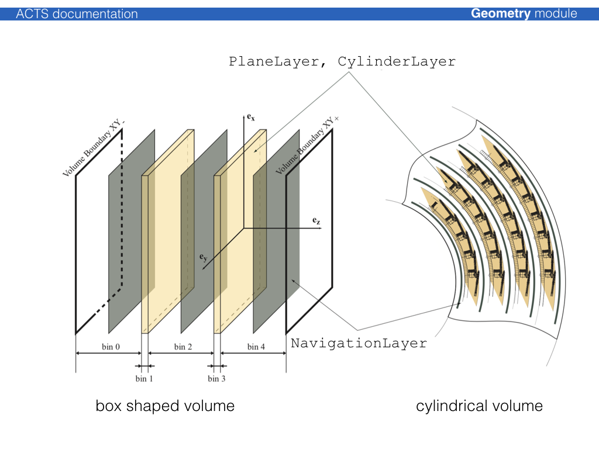

<!--
SPDX-PackageName: "ACTS"
SPDX-FileCopyrightText: 2016 CERN
SPDX-License-Identifier: MPL-2.0
-->

# Layer classes

The {class}`Acts::Layer` class is an extension of the {class}`Acts::Surface` class that allows the
definition of sub surfaces (sensitive surfaces for modules, or extra material
surfaces).

The layer can simply correspond to a 'virtual' surface in the detector
description or represent a more complex object that may contain:

* a representing surface, which is accessible via a {func}`Acts::Layer::surfaceRepresentation`
* an array of contained surfaces, accessible via {func}`Acts::Layer::surfaceArray` method
* approach surfaces (i.e. boundary surface of the volume occupied by the layer)
* surface material description on any of the confined surfaces

The following illustration shows an $xy$ view of a cylinder layer with planar
detection modules:

Modules can be sorted onto layer using all supported binning methods described
through the {class}`Acts::SurfaceArray` class. The binning can be adjusted to fit as well as
possible.

The unoccupied space in a volume that contains a layer array is filled with
objects of type {class}`Acts::NavigationLayer`, which allows that in a fully static geometry
setup, every single point in a volume can be associated with a layer. Layer
objects are confined together in a special {type}`Acts::LayerArray` class and can be
contained by a {class}`Acts::TrackingVolume`.

